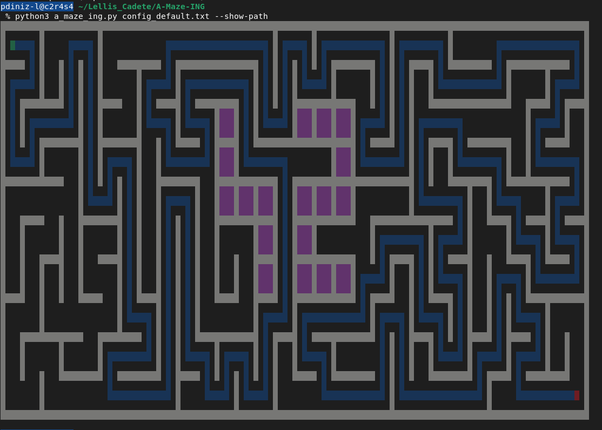

*This project has been created as part of the 42 curriculum by <pdiniz-l>, <vzani-st>*

# A-Maze-ing



## Description

**A-Maze-ing** is a Python project that generates mazes from a configuration file, outputs them in a structured hexadecimal representation, and provides a visual representation of the generated maze.

The program reads a configuration file defining maze parameters (size, entry/exit coordinates, output file, and generation options), generates a valid maze, and writes it to an output file. Each maze cell is encoded using a hexadecimal value that represents the presence of walls on its four sides.

The project also includes a reusable maze generation module designed to be packaged and installed as a Python package (`mazegen-*`). This allows the generation logic to be reused in other applications.

The project follows the technical requirements defined in the official project subject. :contentReference[oaicite:0]{index=0}

Key objectives of the project include:

- Generate valid mazes with configurable parameters
- Support reproducibility through deterministic random seeds
- Encode maze structure using hexadecimal wall representation
- Provide visual rendering of the maze
- Structure the maze generator as a reusable Python module
- Follow Python best practices (type hints, linting, packaging)

---

# Instructions

## Requirements

The project requires:

- Python **3.10 or later**
- flake8
- mypy
- build tools

Dependencies are listed in:

```
requirements.txt
```

---

## Installation

Create the virtual environment and install dependencies:

```bash
make install
```

This command installs the required dependencies for the project.

---

## Run the program

The project must be executed using the following command:

```bash
python3 a_maze_ing.py config.txt
```

Where:

- `a_maze_ing.py` is the main program file.
- `config_default.txt` is the configuration file defining the maze parameters. :contentReference[oaicite:1]{index=1}

Example using the default configuration:

```bash
make run
```

---

## Debug mode

To run the program with Python's debugger:

```bash
make debug
```

---

## Linting and type checking

To verify code quality and type correctness:

```bash
make lint
```

This runs:

```bash
flake8 .
mypy .
```

---

## Clean project artifacts

Remove temporary files and caches:

```bash
make clean
```

Remove additional build artifacts:

```bash
make distclean
```

---

## Build the reusable module

The maze generator can be packaged as a reusable Python package:

```bash
make build
```

The resulting package will be placed in the `dist/` directory.

---

# Configuration File Format

The maze is configured through a **plain text configuration file** containing one key-value pair per line.

Lines starting with `#` are treated as comments and ignored.

Example configuration file:

```
WIDTH=30
HEIGHT=10
ENTRY=0,0
OUTPUT_FILE=maze.txt
PERFECT=TRUE
EXIT=29,9
```

### Mandatory keys

| Key | Description |
|-----|-------------|
| WIDTH | Maze width (number of cells) |
| HEIGHT | Maze height |
| ENTRY | Entry coordinates `(x,y)` |
| EXIT | Exit coordinates `(x,y)` |
| OUTPUT_FILE | Output filename |
| PERFECT | Indicates whether the maze must be perfect |

A **perfect maze** contains exactly one valid path between the entry and the exit. :contentReference[oaicite:2]{index=2}

---

# Output File Format

The generated maze is written to the output file using **one hexadecimal digit per cell**.

Each digit encodes which walls are closed.

| Bit | Direction |
|-----|-----------|
| 0 | North |
| 1 | East |
| 2 | South |
| 3 | West |

Example values:

```
3  -> 0011
A  -> 1010
```

Cells are written row by row, one row per line.

After the maze grid, the file contains:

1. Entry coordinates
2. Exit coordinates
3. The shortest path between them using the letters `N`, `E`, `S`, `W`

All lines end with `\n`. :contentReference[oaicite:3]{index=3}

---

# Maze Generation Algorithm

The project generates a random maze structure ensuring that:

- Entry and exit exist and are valid
- All cells remain connected
- Neighboring cells maintain consistent walls
- Corridors never exceed the allowed width constraints
- The maze structure is coherent and valid

When the `PERFECT` flag is enabled, the maze must contain exactly one valid path between entry and exit. :contentReference[oaicite:4]{index=4}

---

# Visual Representation

The project includes a visual representation of the maze.

This visualization can be implemented using:

- Terminal ASCII rendering
- A graphical interface using MiniLibX (optional)

The visual representation must clearly show:

- Maze walls
- Entry point
- Exit point
- The solution path

Possible interactions include:

- Regenerating a new maze
- Showing or hiding the shortest path
- Changing wall colours
- Optionally displaying the “42” pattern inside the maze

These requirements are defined in the project subject. :contentReference[oaicite:5]{index=5}

---

# Reusable Module

Maze generation logic must be implemented in a reusable module.

The module provides a class responsible for generating mazes, typically named:

```
MazeGenerator
```

This module must be packaged as a Python package located at the root of the repository and installable using standard packaging tools.

The resulting file may look like:

```
mazegen-1.0.0-py3-none-any.whl
```

This reusable module allows future projects to import and reuse the maze generation logic. :contentReference[oaicite:6]{index=6}

---

# Example Usage

Example usage of the generator module:

```python
from mazegen import MazeGenerator

generator = MazeGenerator(width=20, height=15)
maze = generator.generate()

solution = generator.solve()
```

The module should allow:

- Instantiating a maze generator
- Passing parameters such as size or seed
- Accessing the generated maze structure
- Accessing a valid solution path

---

# Repository Structure

Example repository structure:

```
A-Maze-ING-main
│
├── a_maze_ing.py
├── mazegen.py
├── config_default.txt
├── requirements.txt
├── pyproject.toml
├── Makefile
│
├── src
│   ├── app.py
│   ├── model.py
│   └── render
│       ├── ascii_renderer.py
│       └── palette.py
│
└── LICENSE
```

Main components:

| File | Purpose |
|-----|--------|
| a_maze_ing.py | Main entry point of the application |
| mazegen.py | Reusable maze generator module |
| config_default.txt | Default configuration file |
| src/ | Application logic |
| Makefile | Development automation |

---

# Team and Project Management

## Roles

Pendência — the repository does not contain:

- student names
- 42 logins
- team role distribution

---

## Project Planning

Pendência — no documentation about:

- initial planning
- milestones
- development timeline

---

## Retrospective

Pendência — the following information is not available:

- what worked well during the project
- what could be improved
- tools used during development

---

# Resources

Classic references on maze generation and graph algorithms:

- https://en.wikipedia.org/wiki/Maze_generation_algorithm
- https://weblog.jamisbuck.org/2010/12/27/maze-generation-recursive-backtracking
- Graph theory resources on spanning trees

### AI Usage

AI tools were used for:

- documentation drafting
- structuring the README
- formatting explanations

All generated content was reviewed and validated before inclusion.
- project planning timeline
- retrospective analysis
- confirmation of the exact maze generation algorithm
